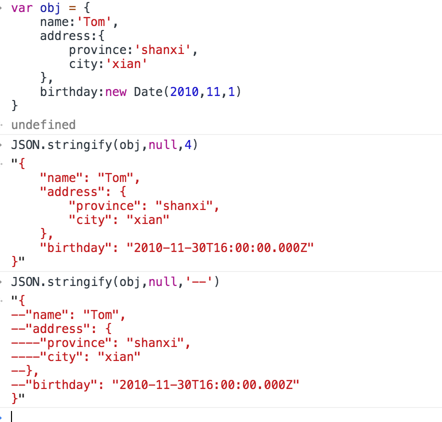

# JSON
>2020-04-08
<tag-part tagName="json"/><tag-part tagName="js"/>

[[toc]]

## 1.JSON简述

* JSON是一种轻量级的数据格式，多种语言都在使用

* JSON中可以表示字符串、数值、null、Boolean

* JSON对象中属性名和属性值都必须为双引号引起来

* JSON对象中最后一个key/value后面不能留逗号

```json
"Hello World"
["erwe", 25,true]
{
    "name": "zhangsan",
    "age": 14
}
```

```js
JSON.parse('"hello"')
"hello"
JSON.parse(null)
null
JSON.parse(21)
21
JSON.parse(true)
true
```

## 2.JSON.stringify()

——将js对象序列化成JSON字符串

### 1).过滤结果：

* 属性值为undefined自动过滤；
* 属性名或属性值为symbol的自动过滤
* 第二个参数传入一个数组，结果只包括数组中存在(且对象中存在)的属性名；
* 第二个参数可以是一个函数（key,value）

```js
var obj = {
    name:'Tom',
    age:11,
    address:{
        province:'shanxi',
        city:'xian'
    },
    value:undefined,
    [Symbol(1)]:1,
    test:Symbol('test'),
}

JSON.stringify(obj) // "{"name":"Tom","age":11,"address":"beijing"}"
JSON.stringify(obj,["name","age"]) // "{"name":"Tom","age":11}"
JSON.stringify(obj,["name","age1"]) // "{"name":"Tom"}"

JSON.stringify(obj,function(key,value){
    if(key === 'age'){
        return 20
    }
    return value
})
// "{"name":"Tom","age":20,"address":"beijing"}"
```
### 2).字符串缩进

第三个参数控制结果中的缩进和空格符：

* 如果是数值的话就是每级缩进空格数（最大值为10）；
* 如果是字符串的话就是缩进字符；

```js
var obj = {
    name:'Tom',
    address:{
        province:'shanxi',
        city:'xian'
    },
    birthday:new Date(2010,11,1)
}
```




### 3).toJSON()

可进行自定义序列化：
如果对象定义了toJSON()方法的话，
使用JSON.stringify(obj),
会直接返回toJSON()的执行结果

```js
var obj = {
    name: 'Tom',
    address: {
        province: 'shanxi',
        city: 'xian'
    },
    toJSON() {
        return this.name //①
        // return {name:this.name} // ②
        // return this // ③  
    }
}

// ①
console.log(obj.toJSON()) // Tom
JSON.stringify(obj) // Tom

// ②
console.log(obj.toJSON()) // {"name":"Tom"}
JSON.stringify(obj) // "{"name":"Tom"}"
// ③ 
console.log(obj.toJSON()) // {"name":"Tom","address":{"province":"shanxi","city":"xian"}}
JSON.stringify(obj) //  "{"name":"Tom","address":{"province":"shanxi","city":"xian"}}"
```


**Date对象内置了toJSON()，其运行结果和toISOString()值一致**

```js
const date = new Date()
console.log(date.toJSON()) // 2020-04-12T10:10:32.601Z
console.log(date.toISOString()) // 2020-04-12T10:10:32.601Z
console.log(date.toJSON() === date.toISOString()) // true
```

## 3.JSON.parse()——解析JSON

如果传入值不是标准的JSON字符串的话，就会报错

JSON.parse()第二个参数可以使用函数(key,value)

```js
var obj = {
    name: 'Tom',
    address: {
        province: 'shanxi',
        city: 'xian'
    },
    birthday: new Date(2010, 11, 1)
}

var objToJSON = JSON.stringify(obj)

console.log(JSON.parse(objToJSON)) 
/* {name: "Tom"
    address: { province: "shanxi", city: "xian" }
    birthday: "2010-11-30T16:00:00.000Z"
} */
```

```js
var objparse = JSON.parse(objToJSON, function (key, value) {
    if (key === 'birthday') {
        return new Date(value)
    }
    if (key === 'city') {
        return "xianyang"
    }
    return value
})

console.log(objparse)
/* {name: "Tom"
    address: { province: "shanxi", city: "xianyang" }
    birthday: Wed Dec 01 2010 00: 00: 00 GMT + 0800(中国标准时间) 
    }
*/
```

## 4.利用JSON进行深拷贝

```js
const obj1={count:1,name:'grace',age:1};
const obj2 = JSON.parse(JSON.stringify(obj1));
```

> 使用JSON比较简单，但是JSON的深拷贝方式会忽略函数对象和原型对象

```js
// 忽略了函数属性
const obj1 = {
    name:'grace',
    getName(){console.log(this.name)}
}
const obj2 = JSON.parse(JSON.stringify(obj1));// {name:'grace'}
```

```js
// 忽略原型对象
var obj = {name:'Tom'}
var obj1 = Object.create(obj)
console.log(obj) // {name: "Tom"}
console.log(obj1) // {}
console.log(obj1.name) // "Tom" (原型上存在name属性)
console.log(obj1.__proto__) // {name: "Tom"}


const obj2 = JSON.parse(JSON.stringify(obj1));

console.log(obj2) // {}
console.log(obj2.name) // undefined 没有拷贝过来它的原型对象
console.log(obj2.__proto__) // {constructor: ƒ, __defineGetter__: ƒ, __defineSetter__: ƒ, hasOwnProperty: ƒ, …}（对象的原型）
```

