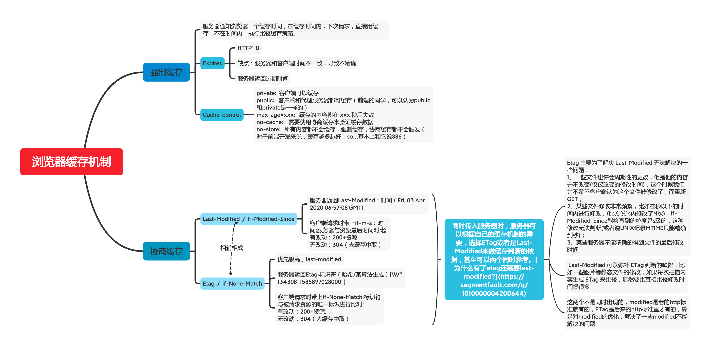

# 浏览器缓存机制

> 20191205

**文章内容详细查看博客园上早期学习的：[缓存机制的理解](https://www.cnblogs.com/gtlm/p/7797743.html)**

[为什么有了etag还需要last-modified?](https://segmentfault.com/q/1010000004200644)

## 强制缓存

> 服务器通知浏览器一个缓存时间，在缓存时间内，下次请求，直接用缓存，不在时间内，执行比较缓存策略。

### Expires

- HTTP1.0
- 缺点：服务器和客户端时间不一致，导致不精确
- 服务器返回过期时间

### Cache-control

* private:  客户端可以缓存
* public:   客户端和代理服务器都可缓存（前端的同学，可以认为public和private是一样的）
* max-age=xxx:   缓存的内容将在 xxx 秒后失效
* no-cache:    需要使用协商缓存来验证缓存数据
* no-store:   所有内容都不会缓存，强制缓存，协商缓存都不会触发（对于前端开发来说，缓存越多越好，so...基本上和它说886）

## 协商缓存

> 将缓存信息中的Etag和Last-Modified通过请求发送给服务器，由服务器校验，返回304状态码时，浏览器直接使用缓存。

### Last-Modified  /  If-Modified-Since

- 服务器返回Last-Modified：时间（Fri, 03 Apr 2020 06:57:08 GMT)
- 客户端请求时带上if-m-s：时间;服务器与资源最后时间对比;有改动：200+资源
无改动：304（去缓存中取）

### Etag  /  If-None-Match

- 优先级高于last-modified
- 服务器返回Etag:标识符（哈希/某算法生成`[W/"134308-1585897028000"]`)
- 客户端请求时带上If-None-Match:标识符
与被请求资源的唯一标识进行比对;
有改动：200+资源;
无改动：304（去缓存中取）

[前端缓存最佳实践](https://juejin.im/post/5c136bd16fb9a049d37efc47)分别指出了强制缓存和协商缓存的问题，并给出了一些最佳缓存实践，可学习；