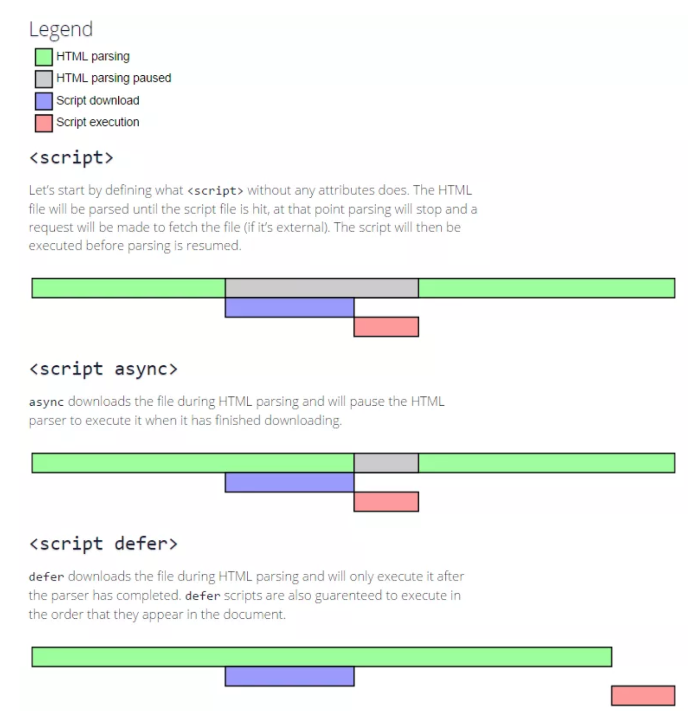
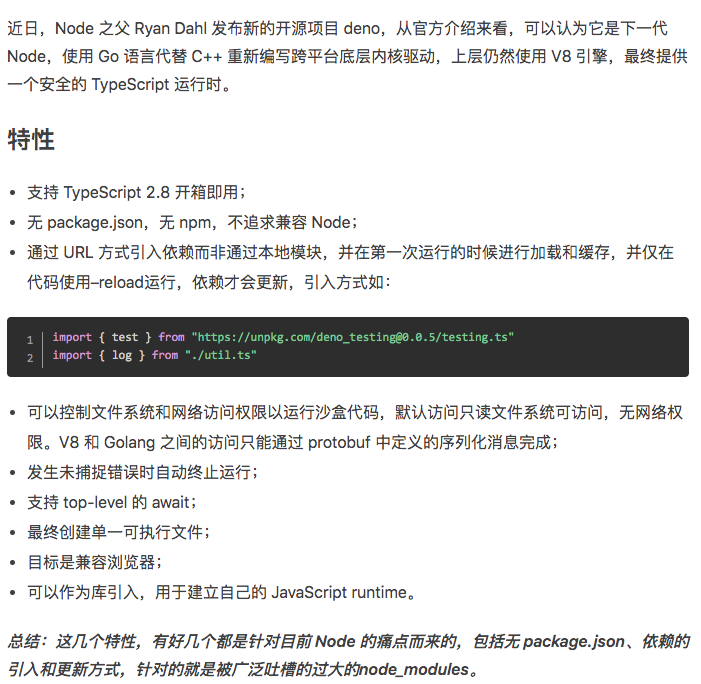

# 前端模块化发展
>2019-12-09

[[toc]]

## 总览


***

## 补充note：

### CommonJS为什么不能用在浏览器

服务端代码在硬盘，加载模块时间几乎忽略不计。浏览器端就不成了。
模块引用未被function，所以暴露在了全局之下

### AMD的作者指出commonJS的缺点：
1.缺少模块封装的能力：一个文件只能是一个模块，不能多个
2.使用同步的方式加载依赖：导致浏览器白屏时间长
3.使用export对象暴漏模块并附加要导出的变量，不能对export直接赋值，如果要导出一个构造函数需要使用module.export--“疑惑”


### RequireJS简单实现：

```js
var MyModules = (function(){
    var modules = [];
    function define(name, deps, cb) {
        deps.forEach(function(dep, i) {
            deps[i] = modules[dep];
        });
        modules[name] = cb.apply(cb, deps);
    }
    function get(name) {
        return modules[name];
    }
    return {
        define: define,
        get: get
    };
})();
MyModules.define('add', [], function() {
    return function(a, b) {
            return a + b;
        };
})
MyModules.define('foo', ['add'], function(add) {
    var a = 3;
    var b = 4;
    return {
        doSomething: function() {
            return add(a, b) + a;;
        }
    };
})
var add = MyModules.get('add');
var foo = MyModules.get('foo');
console.log(add(1, 2));
console.log(foo.doSomething());
```

### sea.js

sea.js 的依赖都是在 factory 中声明的，在模块被调用的时候，sea.js 会将 factory 转成字符串，然后匹配出所有的 require('xxx') 中的 xxx ，来进行依赖的存储。


使用状态机进行词法分析的方式获取 require 依赖

### RequireJS和Sea.js之间的区别

其实 sea.js 的代码逻辑大体上与 RequireJS 类似，都是通过创建 script 标签进行模块加载，并且都有实现一个模块记载器，用于管理依赖。

主要差异在于，sea.js 的懒加载机制，并且在使用方式上，sea.js 的所有依赖都不是提前声明的，而是 sea.js 内部通过正则或词法分析的方式将依赖手动进行提取的。


### CommonJS和ES Module的区别

CommonJS模块是对象，是运行时加载，运行时才把模块挂载在exports之上（加载整个模块的所有），加载模块其实就是查找对象属性。
ES Module不是对象，是使用export显示指定输出，再通过import输入。此法为编译时加载，编译时遇到import就会生成一个只读引用。等到运行时就会根据此引用去被加载的模块取值。所以不会加载模块所有方法，仅取所需。

CommonJS 模块输出的是一个值的拷贝，ES6 模块输出的是值的引用。
CommonJS 模块是运行时加载，ES6 模块是编译时输出接口。

**CommonJS**:

```js
// a.js
const mod =require('./b')

setTimeout(()=>{
    console.log(mod)
},1000)

// b.js
let mod ='first value'
setTimeout(()=>{
    mod = 'second value'
},500)

module.exports = mod

===================
node a.js

first value
```

**ESM**:

```js
// a.mjs
import { mod } from ./b.mjs'
setTimeout(()=>{
    console.log(mod)
},1000)

// b.mjs
export let mod = 'first value'
setTimeout(()=>{
    mod = 'second value'
},500)


=============================
(将文件后缀存成.mjs，可以没有es6的运行环境使用node --experimental-modules就可以运行)
node --experimental-modules a.mjs
(node:9620) ExperimentalWarning: The ESM module loader is experimental.
second value

```


```js
//module.js
export const name = 'Niko'
export let age = 18

age = 20

// a.js
import {name, age} from './module'

console.log(name, age) // Niko 20

```

**ES6**:

```js
// a-es6.mjs
console.log('running a-es6.js')
import {sum} from './b-es6.mjs'
console.log(sum(1,2))

// b-es6.js
console.log('running b-es6.js')
export const sum = (a,b) => a + b

=====================
node --experimental-modules a-es6.mjs

running b-es6.js
running a-es6.js
3
```

> import命令时编译阶段执行的，在代码运行之前，因此被倒入的模块会先运行，而导入模块的文件会后执行；
> CommonJS中require()可以在运行代码时，根据需要加载依赖项

### ES6 优秀的模块设计 

CommonJS 的设计过于灵活，对静态分析不友好。ES6 module 则有诸多限制：比如说只能在文件的顶部 import（CommonJS 的 require 语法允许在文件的任意位置调用），export { ... } 语法保证了导出的变量不会是 getter/setter 之类奇怪的东西（这个 block 不是一个 Object），变量也不能被重新绑定。以上种种设计可以让分析器一定程度上判断出导入和导出变量的关系，让这个插件的实现成为了可能。

### ESM的加载原理补充：

* 1、ES module规范 陈述了怎样把文件解析为module records，和怎样初始化模块以及求值。没有说在最开始要怎样得到这些文件

* 2、Loader（下载器）去获取到了文件，而loader对于不同的规范来说是特定的。对于浏览器来说--是HTML规范
（浏览器的模块加载都是使用的 `<script>` 标签）。


**模块构造包括如下三个步骤：**

* 1).模块识别（解析依赖模块 url，找到真实的下载路径）；

* 2).文件下载（从指定的 url 进行下载，或从文件系统进行加载）；

* 3).转化为模块记录（module records）


### defer和aysnc



### deno

[Deno, 下一代 Node强势来袭](https://www.jianshu.com/p/0056843df8a9?utm_source=oschina-app)




***


**参考文章：**


* [前端模块化的前世今生](https://mp.weixin.qq.com/s?__biz=MjM5MTA1MjAxMQ==&mid=2651235016&idx=1&sn=d8f63fb59a760720cc40bd569c4754cf&chksm=bd497b4c8a3ef25a1e3abdbf21eca55a6fad98c2e998dc6c13ed1c0bdc2888936ed27a73aa1b&scene=0&xtrack=1&key=1ed37e8b659a146546204f3a8c8e2da36c662e8bec5ca80f2feefd63adda6f3be6766b5e2888f3c858d819da08e429e10681412f83a1d4ac3139693ea54ff5dc30983fd61de1d24e396ee04b505c935b&ascene=0&uin=MjYyNjUxMDk2MA%3D%3D&devicetype=iMac+MacBookPro11%2C4+OSX+OSX+10.13.4+build(17E202)&version=12020610&nettype=WIFI&lang=zh_CN&fontScale=100&exportkey=AUFRfk4U3NkDSsoufTiUjms%3D&pass_ticket=5v4Md%2FRucJPoN1TYBn2p2TuGC196bVUveJxdtt5wIpfYprHcPaCpDYcmBDuD%2BtIN)

* [原生ES-Module在浏览器中的尝试](https://www.cnblogs.com/jiasm/p/9160691.html)

* [JavaScript模块化（ES Module/CommonJS/AMD/CMD）](https://www.jianshu.com/p/da2ac9ad2960)