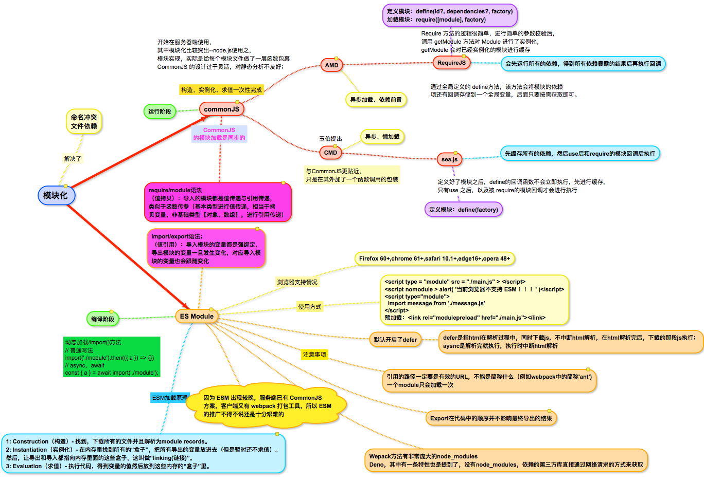

# 前端模块化发展
>2019-12-09

[[toc]]

## 总览



***

## 补充note：

### CommonJS为什么不能用在浏览器

服务端代码在硬盘，加载模块时间几乎忽略不计。浏览器端就不成了。
模块引用未被function，所以暴露在了全局之下

### AMD的作者指出commonJS的缺点：
1.缺少模块封装的能力：一个文件只能是一个模块，不能多个
2.使用同步的方式加载依赖：导致浏览器白屏时间长
3.使用export对象暴漏模块并附加要导出的变量，不能对export直接赋值，如果要导出一个构造函数需要使用module.export--“疑惑”


### RequireJS简单实现：

```js
var MyModules = (function(){
    var modules = [];
    function define(name, deps, cb) {
        deps.forEach(function(dep, i) {
            deps[i] = modules[dep];
        });
        modules[name] = cb.apply(cb, deps);
    }
    function get(name) {
        return modules[name];
    }
    return {
        define: define,
        get: get
    };
})();
MyModules.define('add', [], function() {
    return function(a, b) {
            return a + b;
        };
})
MyModules.define('foo', ['add'], function(add) {
    var a = 3;
    var b = 4;
    return {
        doSomething: function() {
            return add(a, b) + a;;
        }
    };
})
var add = MyModules.get('add');
var foo = MyModules.get('foo');
console.log(add(1, 2));
console.log(foo.doSomething());
```

### sea.js

sea.js 的依赖都是在 factory 中声明的，在模块被调用的时候，sea.js 会将 factory 转成字符串，然后匹配出所有的 require('xxx') 中的 xxx ，来进行依赖的存储。


使用状态机进行词法分析的方式获取 require 依赖

### RequireJS和Sea.js之间的区别

其实 sea.js 的代码逻辑大体上与 RequireJS 类似，都是通过创建 script 标签进行模块加载，并且都有实现一个模块记载器，用于管理依赖。

主要差异在于，sea.js 的懒加载机制，并且在使用方式上，sea.js 的所有依赖都不是提前声明的，而是 sea.js 内部通过正则或词法分析的方式将依赖手动进行提取的。


### CommonJS和ES Module的区别

CommonJS模块是对象，是运行时加载，运行时才把模块挂载在exports之上（加载整个模块的所有），加载模块其实就是查找对象属性。
ES Module不是对象，是使用export显示指定输出，再通过import输入。此法为编译时加载，编译时遇到import就会生成一个只读引用。等到运行时就会根据此引用去被加载的模块取值。所以不会加载模块所有方法，仅取所需。

CommonJS 模块输出的是一个值的拷贝，ES6 模块输出的是值的引用。
CommonJS 模块是运行时加载，ES6 模块是编译时输出接口。

**[tlm时刻]**：就下面两段代码用值拷贝和值引用来解释一下：CommonJS是值拷贝我们可以理解为直接执行拿走，不会等异步等什么的后续影响，不受原来模块改变影响；ES6模块是值引用，受原模块后续执行的影响，只是在编译时将代码引入进来了而已。而CommonJS模块化直接是在直接运行处理的。

**CommonJS**:

```js
// a.js
const mod =require('./b')

setTimeout(()=>{
    console.log(mod)
},1000)

// b.js
let mod ='first value'
setTimeout(()=>{
    mod = 'second value'
},500)

module.exports = mod

===================
node a.js

first value
```

**ESM**:

```js
// a.mjs
import { mod } from ./b.mjs'
setTimeout(()=>{
    console.log(mod)
},1000)

// b.mjs
export let mod = 'first value'
setTimeout(()=>{
    mod = 'second value'
},500)


=============================
(将文件后缀存成.mjs，可以没有es6的运行环境使用node --experimental-modules就可以运行)
node --experimental-modules a.mjs
(node:9620) ExperimentalWarning: The ESM module loader is experimental.
second value

```


```js
//module.js
export const name = 'Niko'
export let age = 18

age = 20

// a.js
import {name, age} from './module'

console.log(name, age) // Niko 20

```

**ES6**:

```js
// a-es6.mjs
console.log('running a-es6.js')
import {sum} from './b-es6.mjs'
console.log(sum(1,2))

// b-es6.js
console.log('running b-es6.js')
export const sum = (a,b) => a + b

=====================
node --experimental-modules a-es6.mjs

running b-es6.js
running a-es6.js
3
```

> import命令时编译阶段执行的，在代码运行之前，因此被倒入的模块会先运行，而导入模块的文件会后执行；
> CommonJS中require()可以在运行代码时，根据需要加载依赖项

### ES6 优秀的模块设计 

CommonJS 的设计过于灵活，对静态分析不友好。ES6 module 则有诸多限制：比如说只能在文件的顶部 import（CommonJS 的 require 语法允许在文件的任意位置调用），export { ... } 语法保证了导出的变量不会是 getter/setter 之类奇怪的东西（这个 block 不是一个 Object），变量也不能被重新绑定。以上种种设计可以让分析器一定程度上判断出导入和导出变量的关系，让这个插件的实现成为了可能。

### ESM的加载原理补充：

* 1、ES module规范 陈述了怎样把文件解析为module records，和怎样初始化模块以及求值。没有说在最开始要怎样得到这些文件

* 2、Loader（下载器）去获取到了文件，而loader对于不同的规范来说是特定的。对于浏览器来说--是HTML规范
（浏览器的模块加载都是使用的 `<script>` 标签）。


**模块构造包括如下三个步骤：**

* 1).模块识别（解析依赖模块 url，找到真实的下载路径）；

* 2).文件下载（从指定的 url 进行下载，或从文件系统进行加载）；

* 3).转化为模块记录（module records）


# 关于commonJS和ES6模块化补充——在阅读《你不知道的JavaScript》之后

> 2020.6.13

上卷中第5章介绍了闭包的原理，随后在5.5中引出了一个利用闭包的——模块；

模块模式的两个必要条件：

* 1.必须有外部的封闭函数，该函数必须至少被调用一次（每次调用都会创建一个新的模块实例）
* 2.封闭函数必须返回至少一个内部函数，这样内部函数才能在私有作用域中形成闭包，并且可以访问或者修改私有的状态

现代模块机制(commonJS)——大多数模块依赖加载器/管理器本质都是将这种模块定义封装进一个友好的API；核心代码：

```js
modules[name] = impl.apply(impl,deps)
```

为了模块的定义引入了包装函数（可以传入任何依赖），并且将返回值，也就是模块的API，存储在一个根据名字来管理的模块列表中。

**[tlm时刻]**：之前的commonJs的模块化，简单的理解就是一个函数，暴露出其内部的方法（函数）或者变量，尤其是内部的方法会调用内部的变量，此时内部的方法实际就一个内部的词法作用于，而在外部我们会调用这个方法，此时就相当于在外部作用域执行来，所以就是一个闭包；而这种模块化，就是在加载器过程中，只是将函数引进来，并没有什么判断什么的；（以下为引用）——

而**ES6模块化**，为之前这种模块化增加了一级语法支持。

**ES6模块化**API是静态的（API不会在运行时改变)，所以在编译时就会判断导入API成员的应用是否真实存在。如果不存在，编译器就会跑出错误，而不会等到运行期在动态解析（报错）；

**[tlm时刻]**：这样编译过程中就费时了，所以又出来懒加载，以及ES2020出来的动态加载；


基于函数的模块（commonJS---**[tlm时刻]**)并不是一个被静态识别的模式（编译器无法识别），它们的API语仪只有在运行时才会被考虑进来（函数执行时才会判断呀，不执行就不管什么情况---**[tlm时刻]**)。因此可以在运行时修改一个模块的API

***


# **补充闭包原理再理解：**


**[tlm时刻]**——之前理解的是只要在其外部作用域使用就是闭包了，比如下面的代码之前认为就可以理解成闭包，实际上是差一点。这本书讲的更清晰了。

```js
// 这里bar()访问了自身外部作用域的变量a,或者平时一个函数里面访问了全局变量，之前理解都可以认为是闭包，实际上来说——这只是闭包的一部分，只是词法作用域的查找规则
function foo(){
	var a = 2;
	function bar(){
		console.log( a )
	}
	bar()
}

foo()
```

下面这个是真正的闭包：

```js
// 将bar()函数本身当作一个值类型进行传递；
// 由于bar()声明的位置，它拥有涵盖foo()内部作用域的闭包，使得该作用域可以一直存活，以供bar()在之后任何时间进行引用——这个对该作用域的引用就叫闭包；所以foo()即使已经执行了，也不会被垃圾回收
function foo(){
  var a = 2
  
  function bar() {
    console.log( a )
  }
  
  return bar
}

var baz = foo()
baz()// 2——这就是闭包的效果
```

***


补充**词法作用域**：

作用域分为两种：词法作用域和动态作用域

词法作用域是由你在写代码时将变量和块作用域写在哪里来决定的，因此当词法分析器处理代码时会保持作用域不变（除了eval,with)。

让词法作用域根据词法关系保持书写时的自然关系不变，是一个非常好的最近实践。

无论函数在哪里被调用，也无论它如何被调用，它的词法作用域都只由函数被生命时所处的位置决定。

***


无论使用何种方式对函数类型的值进行传递，当函数在别处被调用时都可以观察到闭包；

本质上无论何时何地，如果将（访问它们各自词法作用域的）函数当作第一级的值类型并到处传递，你就会看到闭包在这些函数中的应用。在定时器、事件监听器、Ajax请求、跨窗口通信、Web Workers或者任何其他的异步（或者同步）任务中，只要使用了回调函数，实际上就是在使用闭包；


下面的IIFE是闭包吗？

```js
var a = 2;
(function IIFE(){
  console.log(a)
})()
```

严格来说这不是闭包，因为上述函数并不是在它本身词法作用域以外执行的。它在定义时所在的作用域中执行（而外部作用域，也就是全局作用域也持有a)。a是通过普通的词法作用域查找而非闭包被发现的；


闭包常见的一个循环代码：

```js
// 每个掩饰函数确实都会将IIFE在每次迭代中创建的作用域封闭起来，但是封闭起来的作用域是空的，它需要自己的变量，用来在每个迭代中存储i的值，如下一个代码（传递进去也是一样的）
for(var i = 0;i< 5;i++){
  (function(){
    setTimeout(function timer(){
      console.log(i);
    },i * 1000)
  })()
}
```


```js
for(var i = 0;i< 5;i++){
  (function(j){
    setTimeout(function timer(){
      console.log(j);
    },j * 1000)
  })(i)
}
```


```js
// let用来劫持块作用域，并且在这个块作用域中声明一个变量，每次迭代都会声明。随后的每个迭代都会使用上一个迭代结束时的值来初始化这个变量
for(let i = 0;i< 5;i++){
    setTimeout(function timer(){
      console.log(i);
    },i * 1000)
}
```


***


**参考文章：**


* [前端模块化的前世今生](https://mp.weixin.qq.com/s?__biz=MjM5MTA1MjAxMQ==&mid=2651235016&idx=1&sn=d8f63fb59a760720cc40bd569c4754cf&chksm=bd497b4c8a3ef25a1e3abdbf21eca55a6fad98c2e998dc6c13ed1c0bdc2888936ed27a73aa1b&scene=0&xtrack=1&key=1ed37e8b659a146546204f3a8c8e2da36c662e8bec5ca80f2feefd63adda6f3be6766b5e2888f3c858d819da08e429e10681412f83a1d4ac3139693ea54ff5dc30983fd61de1d24e396ee04b505c935b&ascene=0&uin=MjYyNjUxMDk2MA%3D%3D&devicetype=iMac+MacBookPro11%2C4+OSX+OSX+10.13.4+build(17E202)&version=12020610&nettype=WIFI&lang=zh_CN&fontScale=100&exportkey=AUFRfk4U3NkDSsoufTiUjms%3D&pass_ticket=5v4Md%2FRucJPoN1TYBn2p2TuGC196bVUveJxdtt5wIpfYprHcPaCpDYcmBDuD%2BtIN)

* [原生ES-Module在浏览器中的尝试](https://www.cnblogs.com/jiasm/p/9160691.html)

* [JavaScript模块化（ES Module/CommonJS/AMD/CMD）](https://www.jianshu.com/p/da2ac9ad2960)