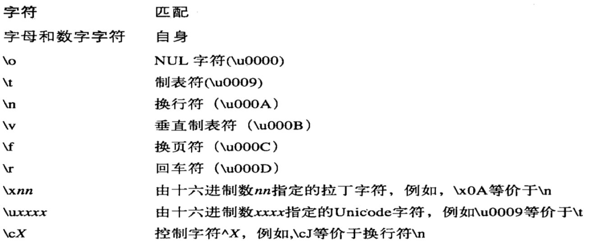
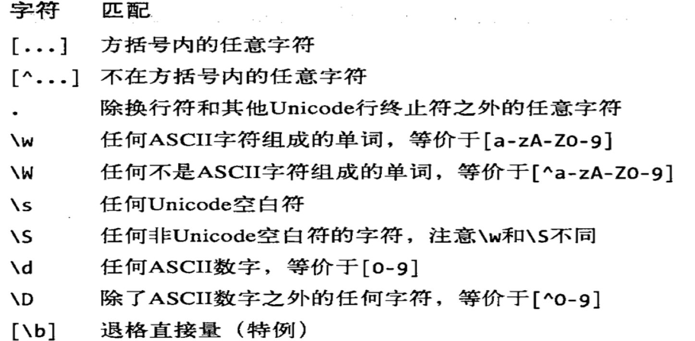
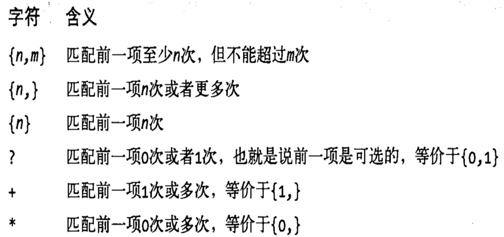
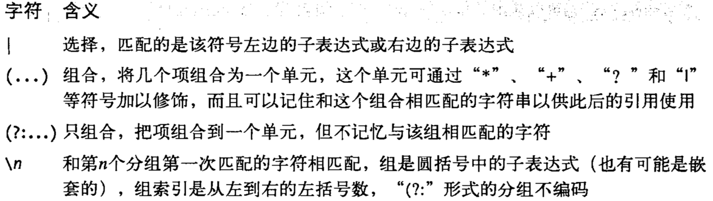
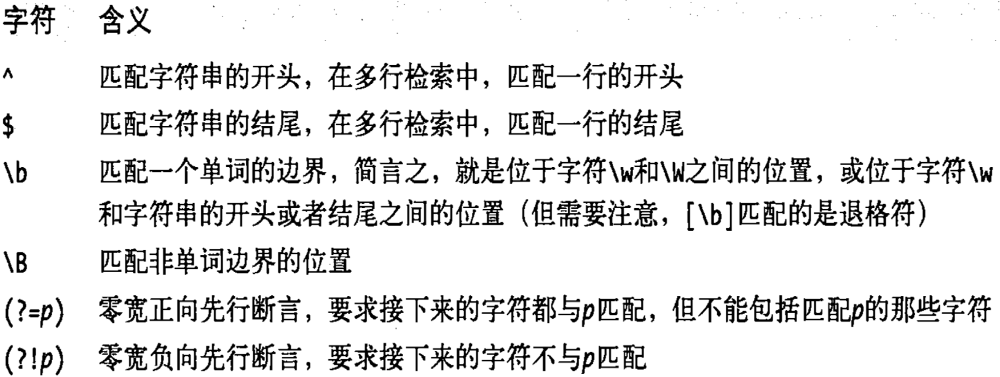
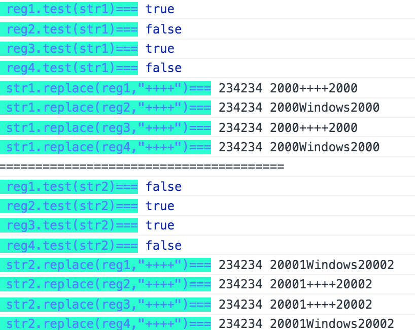
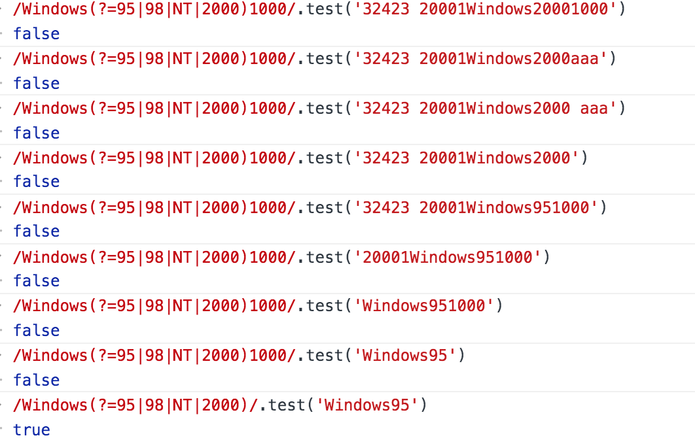
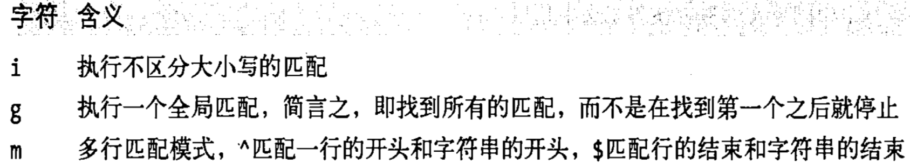
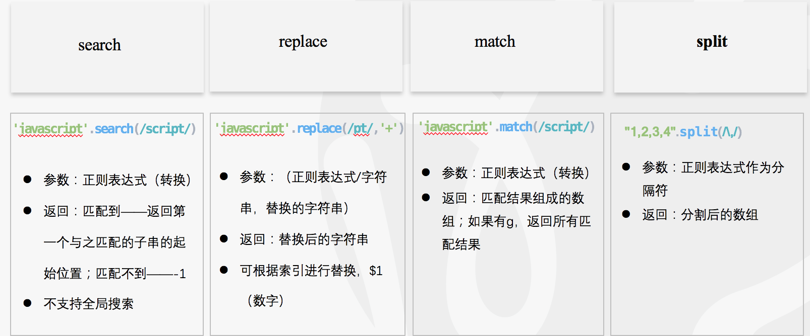
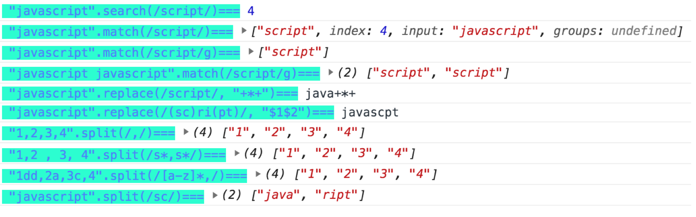

# 正则表达式

> 20191221

[[toc]]

[最全的常用正则表达式大全](https://www.cnblogs.com/zqifa/p/regex-1.html)

[经典JavaScript正则表达式实战](http://zmingcx.com/javascript-regular-expression-real-classic.html)

## 正则定义

###  1.直接量字符

> 正则表达式中的所有字母和数字都是按照字面含义进行匹配的
> 
> 非字母字符---使用`\`作为前缀进行转义
> 
> 如果不记得哪些标点符号需要反斜线转义，可以在每个标点符号前面都加上反斜线
> 

`^ & . * + ? ! : | \ / () [] {}`



### 2.字符类




### 3.重复




*** 

```js
/\d{2,4}/ // 匹配2～4个数字
/\w{3}\d?/ // 精确匹配3个单词和1个可选的数字
/\s+java\s+/ // 匹配前后带有1个或多个空格的字符串"java"
/[^(]*/ // 匹配1个或者多个非左括号的字符
```

* **贪婪匹配：** 尽可能多的匹配
* **非贪婪匹配：**

> 和贪婪匹配相反，其尽可能少的匹配

```js
'1231212'.match(/\d?/)  // '1'
'1231212'.match(/\d??/) // ''

'1231212'.match(/\d{2,4}/)  // 1231
'1231212'.match(/\d{2,4}?/) // 12

'1231212'.match(/\d+/)  // '1231212'
'1231212'.match(/\d+?/) // '1'

'1231212'.match(/\d*/)  // '1231212'
'1231212'.match(/\d*?/) // ''

'1231212'.match(/\d{3,}/)  // '1231212'
'1231212'.match(/\d{3,}?/) // '123'

'1231212'.match(/\d{3}/)  // '123'
'1231212'.match(/\d{3}?/) // '123'
```

***

**特殊**：

```js
'aaab'.match(/a+b/) // aaab
'aaab'.match(/a+?b/) // aaab
```

上述代码中贪婪匹配和非贪婪匹配的值相同——————**因为正则表达式的模式匹配总是会寻找字符串中第一个可能匹配的位置，由于该匹配是从字符串的第一个字符开始的，因此在这里不考虑它的子串中更短的匹配**

### 4.正则的选择、分组、引用




***

* **选择（或） ：** `/ab|cd|ef/`  ab或者cd或者ef
* **分组：** `/(ab|cd)+|ef/`
* **引用：** `/[Jj]ava([Ss]cript)?\sis\s(fun\w*)\.(\1)/`, `\1`就是第一个括号中匹配到的内容  

```js
const reg1 = /[Jj]ava([Ss]cript)?\sis\s(fun\w*)\.(\1)/
const reg2 = /[Jj]ava(?:[Ss]cript)?\sis\s(fun\w*)\.(\1)/

const reg3 = /(['"])[^\1]*\1/


const str1 = 'javascript is fun.script';
const str2 = 'javascript is fun.Script';
const str3 = 'javascript is funa.funba';
const str4 = 'java is fun.fun';

const str5 = 'fbgoabogbagdagaga"gaga"'

console.log(reg1.test(str1)) // true
console.log(reg1.test(str2)) // false
console.log(reg2.test(str3)) // false
console.log(reg2.test(str4)) // true
console.log(reg3.test(str5)) // true
```

### 5.指定位置匹配



***

> 零宽断言

* 零宽先行断言(零宽先行肯定断言)：【要匹配的内容】(?=pattern)
* 负向零宽先行断言 (零宽先行否定断言)：【要匹配的内容】(?!pattern)
* 零宽后发断言(零宽负向肯定断言)：(?<=pattern)【要匹配的内容】
* 负向零宽后发断言(零宽负向否定断言)：(?<!pattern)【要匹配的内容】

> **【tlm时刻】**： 零宽的意思————匹配后的得到的匹配处内容不包含pattern的，所以为零
> 
> 匹配宽度为零，满足一定的条件/断言

> pattern——正则表达式（必须正确匹配）

```js
const reg1= /(?<=95|98|NT|2000)Windows/
const reg2= /(?<!95|98|NT|2000)Windows/
const reg3= /Windows(?=95|98|NT|2000)/
const reg4= /Windows(?!95|98|NT|2000)/

const str1 = '234234 2000Windows2000'
const str2 = '234234 20001Windows20002'

```



> **【tlm时刻】**： 就是说---匹配一个特定内容(pattern)之前(后）的内容。 尤其对于使用字符串匹配方法的时候，拿到匹配的内容是不包含此特定内容的，这个很有用（比如取html元素之间的内容）

```js
const reg= /[Jj]ava([Ss]cript)?(?=\:)/
const str = 'Javascript: The definition Duide'
const str1 = 'Javascript The definition Duide'
const str2 = 'Java: The definition Duide'

console.log(reg.test(str)) // true
console.log(reg.test(str1)) // false
console.log(reg.test(str2)) // true
console.log(str1.match(reg)) // java
console.log(str2.match(reg)) // ["Java", undefined, index: 0, input: "Java: The definition Duide", groups: undefined]
console.log(str2.search(reg)) // java
console.log(str2.replace(reg,'111')) // 111: The definition Duide
```
 


> 经测试，这个断言的标志在正则表达式中只能在最边上才起作用




[.net中的4种零宽断言](https://www.cnblogs.com/windtrace/p/8422332.html)

### 6.修饰符




## 正则匹配的四个string方法

* search
* match
* replace
* split



***



### **补充[replace]**

```js
stringObject.replace(regexp/substr,replacement)
```

**replacement:**

* 字符串
	
	+ 一般字符串
	+ `$`特殊处:
 
	> $1、$2、...、$99:	与 regexp 中的第 1 到第 99 个子表达式相匹配的文本。
	
	> $&	与 regexp 相匹配的子串。
	
	> $`	位于匹配子串左侧的文本。
	
	> $'	位于匹配子串右侧的文本。
	
	> $$	直接量符号。
* 函数

	+ 参数:
	
	```
	 (
		匹配模式的字符串, 
		0 个或多个这样的与模式中的子表达式匹配的字符串,
		声明匹配在 stringObject 中出现的位置,
		stringObject 本身
	)
	```
	
***

```js
var name = 'aaax bbbx cccx';
var uw=name.replace(/\b(\w+)[x]\b/g, function(word,value,index,string){
    console.log(word,value,index,string)
    return word.substring(0,1).toUpperCase()+word.substring(1);}
);

console.log(uw);
// aaax aaa 0 aaax bbbx cccx
// bbbx bbb 5 aaax bbbx cccx
// cccx ccc 10 aaax bbbx cccx
// Aaax Bbbx Cccx

```

## RegExp对象

> 动态创建正则表达式的时候，就需要使用RegExp()构造函数

### 1.RegExp对象有五个属性：

* ignoreCase：（只读）是否有i
* global：（只读） 是否有g
* multiline：（只读）是否有m
* source：（只读） 一个只读的字符串，包含正则表达式的文本
* lastIndex：（可读写）一个可读/写的整数，如果匹配模式带有g，lastIndex就存储在整个字符串中下一次检索的开始位置


```js

var pattern = new RegExp(/Java/,g)

var text = "JavaScript is more fun than Java";
console.log(pattern.lastIndex) // 0
console.log(pattern.ignoreCase); // false
console.log(pattern.global); /// true
console.log(pattern.multiline); // false
console.log(pattern.source); //源文本 Java

var result = pattern.exec(text)

console.log(pattern.lastIndex) // 4
var result1 = pattern.exec(text)
console.log(RegExp(pattern).lastIndex) // 32
var result2 = pattern.exec(text)
console.log(RegExp(pattern).lastIndex) // 0
var result3 = pattern.exec(text)
console.log(RegExp(pattern).lastIndex) // 4
var result4 = pattern.exec(text)
console.log(RegExp(pattern).lastIndex) // 32
console.log(result) // ["Java", index: 0, input: "JavaScript is more fun than Java", groups: undefined]
console.log(result1) // ["Java", index: 28, input: "JavaScript is more fun than Java", groups: undefined]
console.log(result2) // null
console.log(result3) // ["Java", index: 0, input: "JavaScript is more fun than Java", groups: undefined]
```

### 2.RegExp有两个方法

* exec
* test

exec在匹配不到时返回null，匹配到时返回一个数组，可见上面的例子中（数组中有匹配到的文本，匹配到的起始index，input是检索的原字符串）；

test返回true和false

每次执行exec和test，lastIndex都会发生变化，见上方的例子


