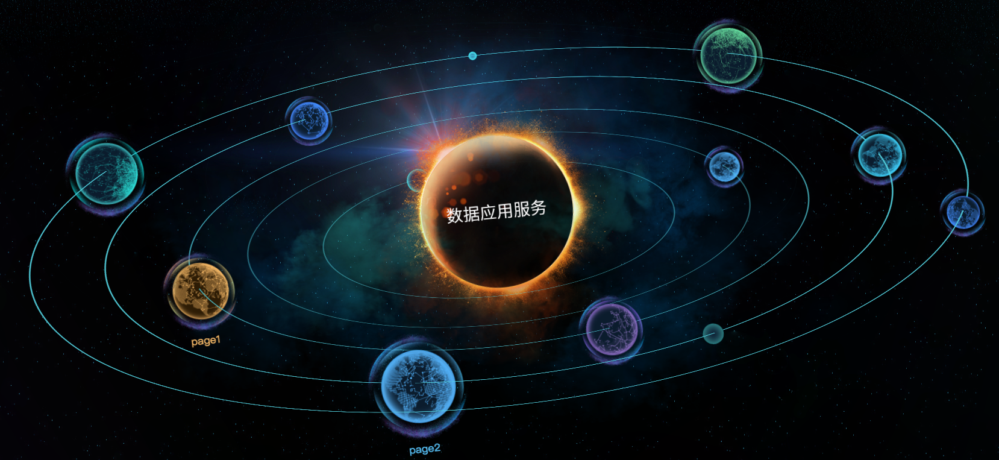

# solarSystem与“穿透能力”`pointer-event`
<tag-part tagName="css"/><tag-part tagName="vue"/>

[[toc]]

<!--  -->


项目要求首页必须酷炫，所以设计成类太阳系，如上图。

::: tip
整个代码实现参考[3D Solar System](http://www.jq22.com/code582)
:::

而今天要特别强调的是一个，我在实现点击球进入某个页面时碰到的问题的解决办法：

问题描述：
由于球要穿轨道而过，所以球和轨道的结构是轨道是球的父元素。
```html
<div id="solar-system">
    <div class="orbit">
        <div class="pos">
            <div class="planet">
                <p class="starLabel"></p>
            </div>
        </div>
    </div>
        <div id="sun">
    </div>
</div>
```
这样的话，在旋转之后，球的下半部分就无法点击了。因为被其他轨道给挡住了。（可以给每个轨道加上背景色看一下）

开始我的解决办法时，监测每个球的位置，使用offsetTop和offsetLeft来取其位置，我们知道这两个只能取相对于其父元素的位置，后来发现在旋转过程中，轨道orbit相对于外层的div位置并没有发生变化。

然后鉴于目前只有两个球是可以点击进去的，所以又在外层做了两个轨道，两个球，将其弄成透明的，使其与原来的两个基本重合，在点击那两个球的时候，就相当于点击这两个透明的，因为这一层级轨道少，所以调整一下基本挡不上。所以这个方法勉强了。

最终在一个同事的新发现中，这个问题被彻底解决了，而且解决的那么完美。
那就是[pointer-events，一个神奇的css属性](https://baijiahao.baidu.com/s?id=1563146573631334&wfr=spider&for=pc)
给轨道上添加
```css
pointer-events:none;
```
给球上添加
```css
pointer-events:auto;
```
不得不感叹，这真是一个神奇的css属性。

vue实现，代码请见[my github](https://github.com/arieltlm/vue-test/tree/master/vue-small-project/solarSystem)
