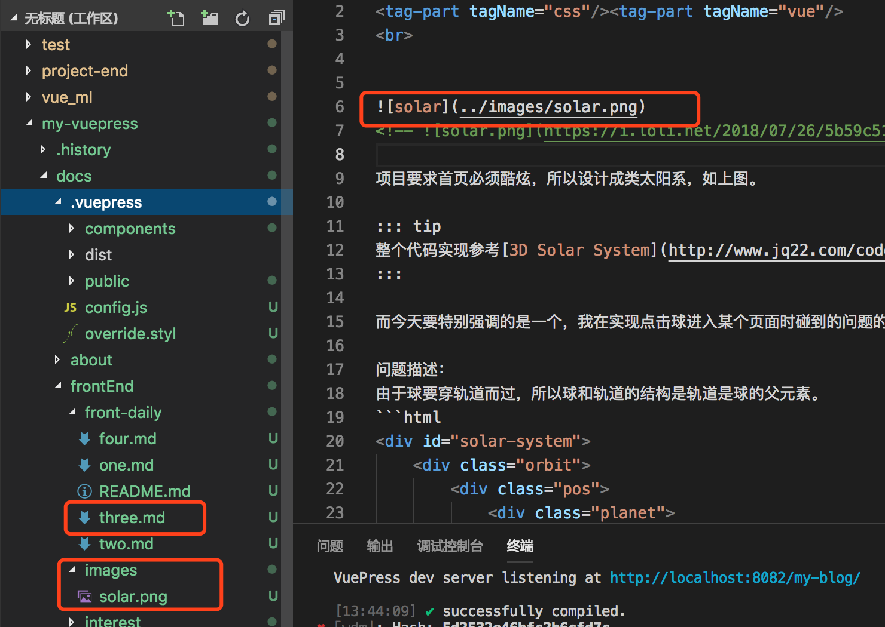

# vuepress 搭建个人博客填坑

> 2018-06-12 <tag-part tagName="vuepress"/>

[[toc]]

---

[我的博客](https://arieltlm.github.io/my-blog/)

## 1.侧边栏

[官网](http://caibaojian.com/vuepress/guide/)上讲了两种方式：

- 你可以使用对象将侧边栏链接分成多个组：

```javascript
// .vuepress/config.js
module.exports = {
	themeConfig: {
		sidebar: [
			{
				title: 'Group 1',
				collapsable: false,
				children: ['/'],
			},
			{
				title: 'Group 2',
				children: [
					/* ... */
				],
			},
		],
	},
}
```

- 如果你希望为不同的页面组显示不同的侧边栏，请先将页面组织到目录中：

```javascript
// .vuepress/config.js
module.exports = {
	themeConfig: {
		sidebar: {
			// 侧边栏在 /foo/ 上
			'/foo/': ['', 'one', 'two'],
			// 侧边栏在 /bar/ 上
			'/bar/': ['', 'three', 'four'],
		},
	},
}
```

**我呢，想如何把两个组合起来使用：**

```javascript
nav: [
    { text: 'Home', link: '/' },
    { text: '前端之路', link: '/frontEnd/' },
    { text: 'one-monent', link: '/life/' },
    { text: 'Github', link: 'https://github.com/arieltlm/' },
],
sidebarDepth: 0,
sidebar:{
    '/frontEnd/':[
        {
            title: 'JavaScript', // 侧边栏名称
            collapsable: true, // 可折叠
            children: [
                '/frontEnd/javascript/', // 你的md文件地址
                '/frontEnd/javascript/one', // 你的md文件地址
            ]
        },
        {
            title: 'css', // 侧边栏名称
            collapsable: true, // 可折叠
            children: [
                '/frontEnd/css/', // 你的md文件地址
                '/frontEnd/css/one', // 你的md文件地址
            ]
        },
    ],
    '/life/':[
        '',
        'one',
        'two'
    ]
}
```

## 2.图片放置位置

在.vuepress 创建 public 文件夹，图片或者静态文件均可以放在此文件夹下，vuepress 在打包时会将此处内容移动到根目录下。

## 3.favicon.ico

config.js 中增加：

```javascript
head:[
    ['link',{rel:'shortcut icon',href:'/icons/favicon.ico'}]
],
```

## 4.在 vuepress 中使用 vue 组件

在.vuepress 下面创建 components。然后组件就和平时写 vue 组件一模一样，要使用 sass 等的也和平常的 vue 一样。

在任何一个 md 文件中都可以直接使用组件，组件名就是文件名。

```html
<tag-part tagName="vuepress" />
```

可参考[github 上 myblog 中标签的实现](https://github.com/arieltlm/my-blog) [博客实例](https://arieltlm.github.io/my-blog/)

**踩坑**：

[官网](http://caibaojian.com/vuepress/guide/using-vue.html)上有说明，确保自定义组件的名称包含连字符或符合 PascalCase 命名规则,否则报错。

## 5.部署运行

在根目录下执行`vuepress build docs` 就会在.vuepress 目录下生成 dist 文件夹

进入 dist 文件夹`cd docs/.vuepress/dist`，执行

```bash
git init
git add -A
git commit -m 'delopy'
git push -f https://github.com/arieltlm/my-blog.git master:gh-pages
 git push -f  https://你的token@github.com/arieltlm/my-blog.git master:gh-pages
```

## 6. vuepress 中 markdown 中 git 命令行高亮的代码为 bash

举例(```bash)：

```bash
git add .
```

## 7. vuepress 中增加样式

在 config.js`head`中增加

```js
head: [
    ["link", { rel: "shortcut icon", href: "/images/favicon.ico" }],
    ["link", { rel: "stylesheet", href: "/style/style.css" }],
],
```

路径是相对于 pubilc，所以将文件只需要放在 public 文件夹下即可。

或者在 override.styl 文件中直接添加也可以

## 8. .md 文件中添加图片



## 9. 代码中的行高亮,添加显示行号

如下第 5 行是高亮的，在```js 增加{5}即可

```js {5}
console.log(111)

var a = 1 + 1
// 输出a
console.log(a)
```

在 config.js 中配置下面的 markdown 配置，可显示行号：

```js
module.exports = {
	markdown: {
		lineNumbers: true,
	},
}
```

## 10. 显示各类信息

```bash
::: tip
这是一个提示
:::

::: warning
这是一个警告
:::

::: danger
这是一个危险警告
:::

::: details
这是一个详情块，在 IE / Edge 中不生效
:::

```

::: tip 这是一个提示 :::

::: warning 这是一个警告 :::

::: danger 这是一个危险警告 :::

::: details 这是一个详情块，在 IE / Edge 中不生效 :::

## 11.资源列表

### [表情小图标列表](https://github.com/markdown-it/markdown-it-emoji/blob/master/lib/data/full.json)

## 12.从 sass 切换 less

sass 总是各种坑，不想用了，换成 less，安装后报错；原来是 less 的版本太高了，换成less-loader@7.3.0可以了
