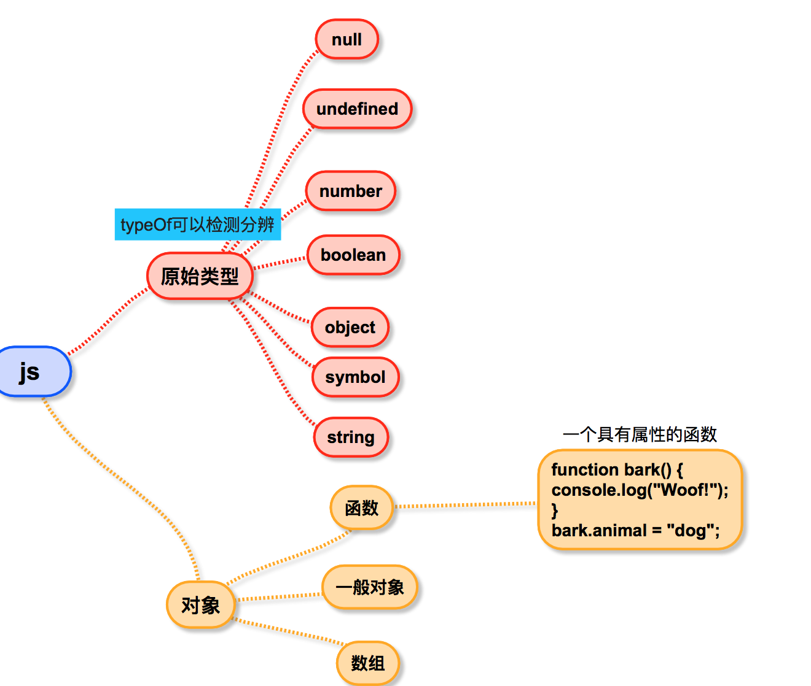

# 前端爱好者学习周刊：第6期
> 20191215


[[toc]]


## 1.扩展运算符和Object.assign({})使用哪个？
[[译] Object.assign 和 Object Spread 之争, 用谁？](https://blog.csdn.net/weixin_34235371/article/details/88009519)

> **问题提出**:这两个用来合并对象的时候，达到的效果是相同的，然后我就想知道我应该使用哪个？


```js
const obj = {a:1,b:2}
const objs = {c:3,d:4}

// 1
const obj1 = {...obj,...objs}

// 2
const obj2 = Object.assign({},obj,objs}
```

1和2都可以做到不改变原对象obj，合并生成新对象的效果。

那么如果可以改变原对象(不关心原对象是否改变）————

```js
// 3
const obj3 = Object.assign(obj,objs}

// 4
Object.assign(obj,objs}

```
3和4都是改变原对象


扩展运算符和object.assign()都只能复制可枚举的属性

```js
const car = {
  color: 'blue'
};

Object.defineProperty(car, 'type', {
  value: 'coupe',
  enumerable: false
});

console.log({...car});    // → {color: "blue"}
// console.log(Object.assign({},car));  // → {color: "blue"}
```

下面这段代码中，Object.assign()方法执行继承的setter属性。相反，扩展属性完全忽略setter。

```js
Object.defineProperty(Object.prototype, 'a', {
  set(value) {
    console.log('set called!');
  }
});

const obj = {a: 10};

console.log({...obj});    
// → {a: 10}

console.log(Object.assign({}, obj));    
// → set called!
// → {}
```

object.assign()和Object spread 操作符都不复制继承的属性或类的属性

```js
const car = {
  color: 'blue'
};

const car2 = Object.create(car, {
  type: {
    value: 'coupe',
    enumerable: true,
  }
});

console.log(car2.color);                      // → blue
console.log(car2.hasOwnProperty('color'));    // → false

console.log(car2.type);                       // → coupe
console.log(car2.hasOwnProperty('type'));     // → true

console.log({...car2});                       // → {type: "coupe"}
```
***

https://css-tricks.com/new-es2018-features-every-javascript-developer-should-know/

此处需注意几点：

* object.assign()和Object spread 操作符都不复制继承的属性或类的属性
* {...obj}等同于Object.assign（{},obj）
* Object spread 操作符总是给你一个普通js对象POJO(Plain Ordinary JavaScript Object)，Object.assign（）函数却修改其第一个传入对象obj---修改就触发了 ES6 setter。（当一个 Object 使用了 Object.defineProperty 修改了 set 方法，因为调用 Object.assign 会触发 setter 方法，会触发意想不到的错误）
* 改变原对象，两个性能几乎一致。如果要求新对象，（给Object.assign（）输入一个空对象参数），对象扩展运算符就会更快


## 2.target和currentTarget

* e.target 指向触发事件监听的对象。
* e.currentTarget 指向添加监听事件的对象，指向代码中点击事件的元素


e.target始终指向即当前点击的目标元素，e.currentTarget在**事件委托**中，如果监听元素不是目标元素，则指向监听元素

## 3.43道基础javaScript面试题

[43 道检验基础的 JavaScript 面试题](https://zhuanlan.zhihu.com/p/75359676)

> **【tlm时刻】**：  前前后后做了3遍了，记录一下“值得”的知识点

### 1.function 的创建，初始化，赋值都被提升
### 2.[题3]this指向其所在上下文环境

```js
const shape = {
  radius: 10,
  diameter() {
    return this.radius * 2;
  },
  perimeter: () => 2 * Math.PI * this.radius
};

shape.diameter();
shape.perimeter();
```

当我们调用perimeter时，它不是指向shape对象，而是指其定义时的环境（window）。没有值radius属性，返回undefined;

答案：20 NaN

### 3.[题7] new Number(3) !== 3

```js
const a = 3;
const b = new Number(3);
	
a == b;  // true
a === b; // false

```
### 4.[题8]static静态方法不能传递给任何子级

```js
class Chameleon {
  static colorChange(newColor) {
    this.newColor = newColor;
  }

  constructor({ newColor = "green" } = {}) {
    this.newColor = newColor;
  }
}

const freddie = new Chameleon({ newColor: "purple" });
freddie.colorChange("orange");  // TypeError

```

### 5.[题10,13,18，39]Javascript由原始类型和对象组成




### 6.[题11]向构造函数添加属性

如果要一次向所有对象添加功能，则必须使用原型。

```
Person.prototype.getFullName = function () {
  return `${this.firstName} ${this.lastName}`;
}
```

### 7.[题12]new 关键字的作用

有new时即创建这个新空对象，没有时，this指向全局对象

```js
function Person(firstName, lastName) {
  this.firstName = firstName;
  this.lastName = lastName;
}

const lydia = new Person("Lydia", "Hallie");
const sarah = Person("Sarah", "Smith");

console.log(lydia); 
console.log(sarah); // undefined
```
 
### 8.[题12,31,32]事件传播的三个阶段：捕获 > 目标 > 冒泡


* 导致事件的最深层嵌套元素是事件的目标

```html
<div onclick="console.log('first div')">
  <div onclick="console.log('second div')">
    <button onclick="console.log('button')">
      Click!
    </button>
  </div>
</div>
```

单击按钮时event.target是button

* 事件处理程序在冒泡阶段执行（除非您将useCapture设置为true

```html
<div onclick="console.log('div')">
  <p onclick="console.log('p')">
    Click here!

</div>
```
单击打印p div

### 9.[题17]对于引用类型，==，===都为false
### 10.TypeError和ReferenceError

ECAM-262中定义了7种错误类型，Error，EvalError，RangeError，ReferenceError，SyntaxError，TypeError，URIError

ReferenceError 同作用域判别失败相关，而 TypeError 则代表作用域判别成功了，但是对结果的操作是非法或者不合理的。

假如查找不到变量。LHS在非严格模式下找不到变量会自动生成全局变量，但是在严格模式会和RHS一样ReferenceError的错误。

假如能查找到变量，对其进行非法或者不正确的操作都会报TypeError的错误。

### 11.[题21]eval执行最外层""包含内的内容

```js
eval("10*10+5"); // 105
eval("10*10+'5'"); // 1005
```

### 12.[题24，29]对象的属性键key都会被存储为string类型

```js
const obj = { 1: "a", 2: "b", 3: "c" };
const set = new Set([1, 2, 3, 4, 5]);

obj.hasOwnProperty("1"); // true
obj.hasOwnProperty(1);   // true
set.has("1");   // false
set.has(1);     // true
```
hasOwnProperty检测一个对象是否含有特定的自身属性


```js
const a = {};
const b = { key: "b" };
const c = { key: "c" };

a[b] = 123;
a[c] = 456;

console.log(a[b]); // 456
```

因为b和c作为键时，都成为`[object,Object]`;即此时的`a={[object,Object]:456}`

### 13.[题26]JavaScript全局执行上下文为你创建了两个东西:全局对象和this关键字

### 14. [题33]call,apply,bind都是改变this指向。

* call和apply(数组)都改变并立即执行
* bind只改变，不会立即执行


```js
const person = { name: "Lydia" };

function sayHi(age) {
  console.log(`${this.name} is ${age}`);
}

sayHi.call(person, 21); // Lydia is 21
sayHi.bind(person, 21); // function
```

### 15.[题35]假值

JavaScript中只有6个假值:undefined,null,NaN,0,'',false

" "(中间有个空格的字符串）不是假值

new Number(0),new Boolean(false)都不是假值

### 16.[题43]字符串用扩展运算符展开

```js
[..."Lydia"] // ["L", "y", "d", "i", "a"]
```
