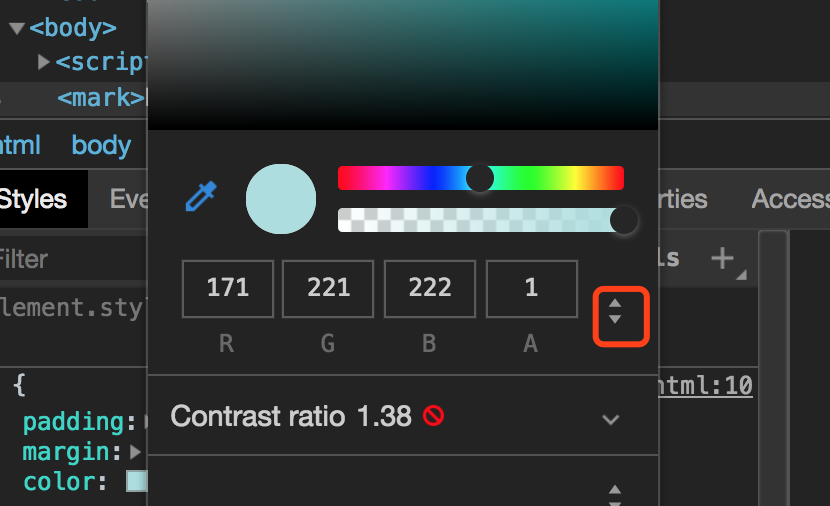

# 前端爱好者学习周刊：第1期


<tag-part tagName="html"/><tag-part tagName="css"/><tag-part tagName="js"/>

[[toc]]

##  1.实现表格的表头固定，内容滚动

```css
table {
    width: 400px;
    border: 1px solid #ccc;
    border-collapse: collapse;
}

th,
td {
    text-align: left;
    border: 1px solid #ccc;
}

tbody {
    display: block;
    width: 100%;
    height: 200px;
    overflow-y: auto;
}

thead,
tbody tr {
    display: table;
    width: 100%;
    table-layout: fixed;
}
```

```html
<table>
    <thead>
        <tr>
            <th>姓名</th>
            <th>学号</th>
            <th>性别</th>
        </tr>
    </thead>
    <tbody>
        <tr>
            <td>张小王</td>
            <td>0000011</td>
            <td>男</td>
        </tr>
        ...
        <tr>
            <td>张小王</td>
            <td>0000011</td>
            <td>男</td>
        </tr>
    </tbody>

</table>
```
此时可以使用[插件scroll](http://manos.malihu.gr/jquery-custom-content-scroller/)插件来美化滚动条

```javascript
//示例1
//html:<div class="content">...</div>
$(".content").mCustomScrollbar({
    theme:"minimal"
});
```

## 2. resize
### 1） 当页面上有多个echarts实例时，在使用`window.onresize`时，就需要将所有实例汇总，写在一个里面。
否则，`window.onresize`会相互覆盖。

```js
var mychart1 = echart.init();
var mychart2 = echart.init();
var mychart3 = echart.init();
window.onresize = function() {
	mychart1 && mychart1.resize();
    mychart2 && mychart2.resize();
    mychart3 && mychart3.resize();
}

```
### 2） echarts实例不销毁只是隐藏的情况下resize起作用

将echarts所在父元素进行显示隐藏，隐藏后若进行window的resize也会引起echarts的resize。

使用mychart.clear()，清除画布，但实例还在。

所以需要在父元素隐藏时使用mychart.dispose()在隐藏的时候，彻底清除实例。（一定要使用resize效果的话，不使用的话，可以不清除实例）

或者使用
```js

window.onresize = function(){
	if($('.test).is(":visible")){
    	mychart.resize();
    }
}

```
此方法不够完美，但是可以凑合（因为用户不会不停的放大缩小页面）。（不销毁实例的情况下，当$('.test')不可见时，resize页面，再show的时候，实例未resize，还保留了上一次的尺寸。

## 3. sass拾遗
### 1） sass中循环取第几个

```css
$listemColor:#00a8ff #0cdddb #ffb400 #ffb400;
@for $i from 1 through 5 { 
    &:nth-child(#{$i}){
        em{
            color:nth($listemColor,$i);
        }
        .right-list-item{ 
            background: url('../images/core/personas/tradehold-icon#{$i}.png') no-repeat 100% 100%;
            background-size: 100% 100%;
        } 
    } 
}
```
### 2）sass中calc中使用变量

```css
$height: 100px;
height: calc(100% - #{$height});
```

## 4. 元素中style上calc的写法

```html
// 注意应该拼接成字符串
<div style={{'height': 'calc(100% -' + topTableHeight + 'px)'}}>
</div>
```

::: tip
以下内容参考[鲜为人知的JavaScript功能](https://juejin.im/post/5c149d23f265da615a41b61d)
:::
## 5. void产生绝对的undefined

```js
void <expression>

void 0; // undefined
void '': // undefined
```

在es5之前，undefined可以进行重新分配值，2⃣️而void之后跟任何有效表达式都会为`undefined`;

## 6. 构造函数的括号可选

> (少写一点代码是好处吧？)

```js
new Date;
new Array;
new MyClass;
```

## 7.agruments属性

* arguments.callee：指向当前调用函数
* arguments.callee.caller：指向当前被调函数的调用者。

虽然ES5禁止在严格模式下使用callee和caller，但在许多编译库中仍然常见。 所以，值得学习它们。

## 8. 标记模版字面量
> 这个挺有意思的

```js
Tagged`Hello ${username}`;
```
Tagged只是一个获取字符串模板解析后的所有字符串和值的数组的解析器函数;

```js
function highlight(strings, ...values) {
    let result = '';
    strings.forEach((str, i) => {
        result += str;
        if (values[i]) {
            result += `<mark>${values[i]}</mark>`;
        }
    })
    return result;
}

const author = 'Herry Avery';
const statement = 'I am a man of fortune';
const quote = highlight`${author} once said, ${statement}`;

console.log(quote); // <mark>Herry Avery</mark> once said, <mark>I am a man of fortune</mark>
document.write(quote)
```


## 9. + 操作符

在字符串前面加个+号把字符串转换成number。

+运算符也适用于负，八进制，十六进制，指数值。 更重要的是，它甚至可以将Date或Moment.js对象转换为时间戳！

```js
+ new Date; // 1545019898468
```

> 在控制台可以直接输入颜色的两位就可以得到做转换：
>
> `#abddde => rgb(171,221,222)`


>再更：
>其实不需要上述：
>只需要点击下面的按钮即可：


## 10. !!Bang Bang 操作符

Bang Bang是一个可以讲任何表达式转换成布尔值的方法: true/false;

```js
!!'';   // false
!!1;    // true
!!null; // false
!!{a:1}; //true
```

## 11. ~位运算符

~N 即 -（N + 1）

仅当N == -1时，此表达式的计算结果为“0”

```js
if（～username.indexOf('a'){
    console.log('没有a')
} else {
    console.log('有a')
}
```

ES6和ES7分别在String＆Array中添加了一个新的.includes（）方法

## 12. js标签语句

js中可以给循环和块命名,如下面这个块名字叫block1：

```js
block1:{
    let i;
}
```

```js
loopBlock: {
    console.log('I will print'); // I will print
    break loopBlock;
    console.log('I will not print');
}
```

```js
forLoop1:
for (var i = 0; i < 3; i++) {
    forLoop2: 
    for (j = 0; j<3; j++) {
        if(i == 1 && j ==1) {
            continue forLoop1; // 跳过了i=1组合的j=1，j=2后面的
        }
        console.log('i = ' + i + ', j = ' + j);
    }
}
console.log('##########');
for (var i = 0; i < 3; i++) {
    for (j = 0; j<3; j++) {
        if(i == 1 && j ==1) {
            continue; // 只跳过了i=1，j=1
        }
        console.log('i = ' + i + ', j = ' + j);
    }
}
console.log('##########');
for (var i = 0; i < 3; i++) {
    if(i == 1 ) {
        continue; // 跳过了所有i等于1的
    }
    for (j = 0; j<3; j++) {
        console.log('i = ' + i + ', j = ' + j);
    }
}
```
