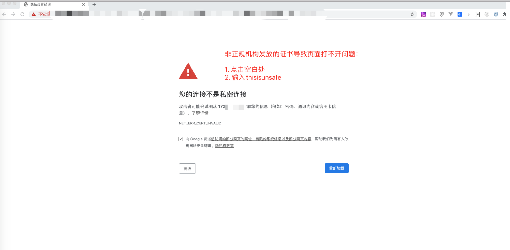
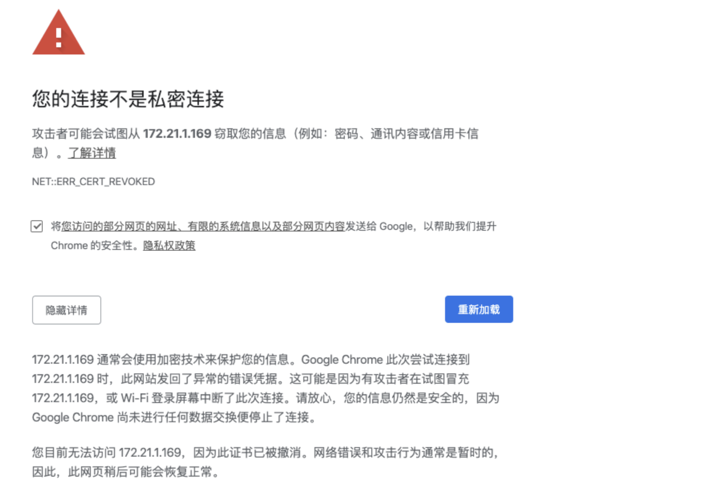

# Mac上chrome无法打开https网站

最有效办法：在空白处点击，输入thisisunsafe



mac升级catalina后，chrome浏览器打开带有证书的网站会出现如下画面:



**解决办法:**

1. 复制chrome地址，在safari里打开;
2. 点击查看此证书，弹出窗口后，选择好;
3. 点击访问网站，确认在safari里能够访问此网站;
4. 回到chrome，设置->高级->隐私设置和安全性->管理证书->打开在safari里增加的证书双击->信任→使用此证书时选择始终信任

mac下执行以下命令打开chrome:

```bash
/Applications/Google\ Chrome.app/Contents/MacOS/Google\ Chrome --ignore-
certificate-errors &> /dev/null &
```

